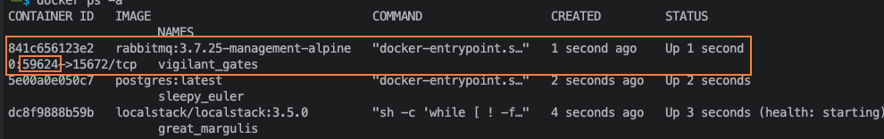

# API Marketplace

API Responsável por gerenciar produtos no marketplace.

## 🗒️ Informações

- Projeto referência para as aulas de testes de integração da Alura.

## 📋 Pré-requisitos

- [OpenJdk 21](https://download.java.net/java/GA/jdk21.0.2/f2283984656d49d69e91c558476027ac/13/GPL/openjdk-21.0.2_linux-x64_bin.tar.gz)
- [IntelliJ Comunity](https://www.jetbrains.com/idea/download/?section=linux)
- [Docker](https://www.docker.com/get-started/)
- Postgres (Imagem Docker)

``` sh
docker run -d -p 5432:5432 --name postgres -e POSTGRES_PASSWORD=postgres postgres
```

- Localstack (Imagem Docker)

``` sh
docker run -d -p 4566:4566 -p 4510-4559:4510-4559 --name=localstack localstack/localstack
```

- RabbitMQ (Imagem Docker)

``` sh
docker run -d -p 5672:5672 --name=rabbitmq rabbitmq
```

- Redis (Imagem Docker)

``` sh
docker run -d -p 6379:6379 --name=redis redis
```

## 🌳 Variáveis de ambiente

| Nome                   | Valor             |
|------------------------|-------------------|
| spring.profiles.active | local,infra_local |

## 📦 Construindo

```mvn clean install -DskipTests```

## ▶️ Executando pacote

``` sh
java -jar -Dspring.profiles.active=local,infra_local application/target/api-market-place.application-0.0.1-SNAPSHOT.jar
```

## 🎬 Executando imagem

``` sh
docker run -d -p 8080:8080 --name=api-market-place rodsordi/api-market-place:master
```

## 👌 Executando Testes

```mvn test```

## 🍿 Executando Testes de Integração

```mvn test -DintegrationTests```

## 📌 Versão

- [SemVer](https://semver.org/lang/pt-BR/)

## Demais anotações do projeto

### Teste Container RabbitMQ

Para validar a questão da publicação da mensagem no tópico existente/criado
pode se valor da seguinte estratégia:

- Após o teste de integração com o teste containter ter sido inicializado
teremos uma versão do docker rodando as imagens, dentre elas o rabbitmq,
então é possível consultarmos qual a porta que o console do rabbitmq subiu
e acessar através do navegador localhost:${porta_rabbitmq}

Para descobrir a porta que o rabbitmq está rodando devemos rodar o seguinte comando:
`docker ps -a`
com isso será listado os containers docker que está sendo executados.

no meu caso aqui a porta utilizada para o rabbitmq foi **59624**:



## ✒ Autores

- [Rodrigo Abreu](https://github.com/rodrigodabreu)

